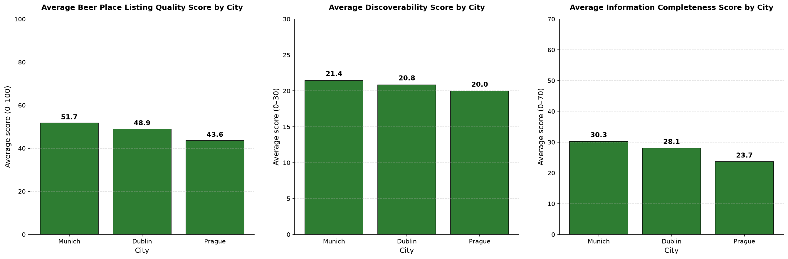
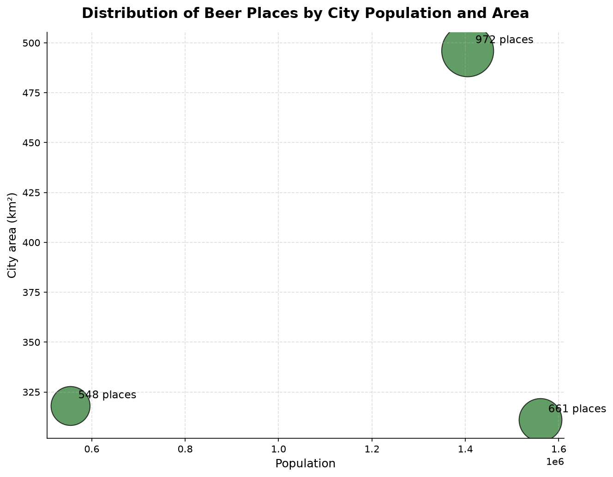

# Beer Listing Quality Analysis

## Overview

This project analyzes the quality and completeness of beer-related place listings
across Prague, Munich, and Dublin using OpenStreetMap data.

The analysis focuses on identifying relevant beer-related venues, standardizing
data across cities, removing duplicate or irrelevant records, and evaluating
the completeness of listing information.

## Data

The project uses GeoJSON datasets for three cities:

- Prague
- Munich
- Dublin

The raw datasets contain OpenStreetMap objects and their associated tags.
Because the available attributes differ between cities, the datasets are
standardized before the analysis.

## Methodology

The analysis consists of several stages:

1. Load the raw GeoJSON datasets.
2. Convert the geographic data into a tabular format.
3. Identify attributes shared across the three city datasets.
4. Standardize city-specific fields into a common structure.
5. Identify beer-related places using:
   - amenity type;
   - beer-related OpenStreetMap tags;
   - brewery and microbrewery information;
   - beer-related venue names;
   - manual validation where necessary.
6. Remove records with missing names and manually confirmed duplicates.
7. Calculate listing quality metrics.
8. Aggregate the results by city.
9. Generate visualizations for the city comparison.

## Project Structure

```text
beer-listing-quality/
├── data/
│   ├── raw/
│   └── processed/
├── main.py
├── eda.py
├── database.py
├── analysis.py
├── visualization.py
├── requirements.txt
├── .gitignore
├── .env
└── README.md
```
## Listing Quality Score

Each beer-related place receives a Listing Quality Score from 0 to 100.

### Discoverability — 30 points

- Primary category (`amenity`) — 20 points
- Additional beer-related classification — 10 points

### Information Completeness — 70 points

| Attribute | Points |
|---|---:|
| Address | 20 |
| Website | 12 |
| Opening hours | 12 |
| Phone | 8 |
| Description | 5 |
| Accessibility | 5 |
| Social media | 3 |
| Email | 2 |
| Other information | 3 |
| **Total** | **70** |

The final score is calculated as:

```text
Listing Quality Score =
Discoverability Score + Information Completeness Score
```

## Data Quality Considerations

OpenStreetMap data is community-generated and therefore varies in completeness
and tagging conventions between cities.

Several additional validation steps are used in this project, including:

combining alternative tags that represent the same type of information;
using multiple signals to identify beer-related places;
manually reviewing ambiguous name-based matches;
manually validating potential duplicate venues.

These steps reduce obvious inconsistencies but do not guarantee that all
relevant venues are present or correctly classified.

## Requirements

Install the required dependencies:

```bash
pip install -r requirements.txt
```

## Running the Project

Run the complete pipeline with:

```bash
python main.py
```

## Results

Beyond the listing quality scores, it's useful to place each city's dataset
in context using population and area as a baseline for the number of
identified beer-related places:

- **Prague** leads in the total number of identified beer-related places,
  giving it the largest dataset to evaluate for listing quality.
- **Munich** combines a large population with a comparatively compact
  geographical area, suggesting a denser concentration of venues per km².
- **Dublin** has fewer establishments in absolute terms, but a high
  concentration relative to its population.

This context matters for interpreting the listing quality results: a city
with more identified places (e.g. Prague) offers a larger sample for
assessing average completeness, while cities with fewer, more concentrated
venues (e.g. Dublin) may be easier to fully document and therefore worth
comparing against for best practices in listing maintenance.


## Visualizations
City scores comparison



Population vs area


